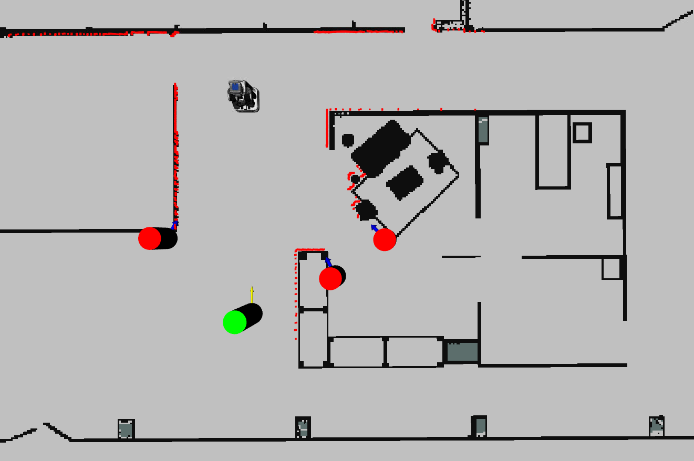

# CoHAN2.0 with Multiverse Docker
This repository provides online implementation of [CoHAN2.0](https://github.com/LAAS-HRI/CoHAN2.0) using MuJoCo Simulator from [Multiverse Framework](https://github.com/Multiverse-Framework).

You can use this framework in two ways: on the cloud or locally.

## Run CoHAN-Multiverse Docker on the Cloud using BinderHub

- [Link to the BinderHub](https://binder.intel4coro.de/v2/gh/sphanit/cohan_multiverse_virtual_labs/HEAD)

## Run CoHAN-Multiverse Docker locally

### Prerequisites

Ensure that you have [Docker](https://docs.docker.com/engine/install/ubuntu/#install-using-the-repository) installed.

Verify your versions of `docker` and `docker compose` by running:

```bash
$ docker -v
Docker version 28.3.2, build 578ccf6
$ docker compose version
Docker Compose version v2.38.2
```

### 1. Set up Docker

Run the following commands to clone the repository and configure Docker:

```bash
$ git clone https://github.com/sphanit/cohan_multiverse_virtual_labs.git && cd cohan_multiverse_virtual_labs

$ docker compose pull
```
Alternatively, you can do some changes to the docker image and build (takes a longer time), instead of pulling the existing image
```bash
$ docker compose build
```

### 2. Start the Docker Compose service

To start the service, run the following command:

```bash
$ docker compose up
```

Once the service is running, open your browser and navigate to [http://127.0.0.1:8888/lab](http://127.0.0.1:8888/lab).

From there, you can either click on "Desktop" to access the virtual machine.

# Run CoHAN2.0 on the desktop

## 1. Test CoHAN
Once you have access to desktop, open the terminal and do the following to test CoHAN2.0
```bash
$ cd /home/CoHAN2.0/
$ source devel/setup.bash
$ roslaunch cohan_sim_navigation cohan_sim_pr2.launch 
```

This should open the RViz like below. You can then use 2D Nav Goal to give goal to the robot to navigate.



## 2. Run CoHAN on Multiverse MuJoCo
1. In one terminal do this:
    ```bash
    $ cd /home
    $ ./Multiverse/Multiverse-Launch/bin/multiverse_launch ./Multiverse-Tutorials/resources/laas/scene_ros1.muv
    ```
2. In another terminal launch CoHAN

    ```bash
    $ cd /home/CoHAN2.0/
    $ source devel/setup.bash
    $ roslaunch cohan_multiverse_navigation cohan_mujoco_tiago.launch
    ```

You will see a different RViz with Tiago and a blue cylinder (representing a mocap agent). You will also notice that there are two 2D Nav Goals. The last one controls the mocap agent position. The first one controls the robot goal.

    a. The robot can be controlled using the first 2D Nav Goal as usual.

    b. The mocap human can be controlled directly through position or velocity (check human_controller.py in cohan_multiverse_navigation). 
    
    c. To control human with velocity use /human_cmd_vel topic. To change or control human pose use /initial_human_pose topic (or the second 2D Nav Goal).
